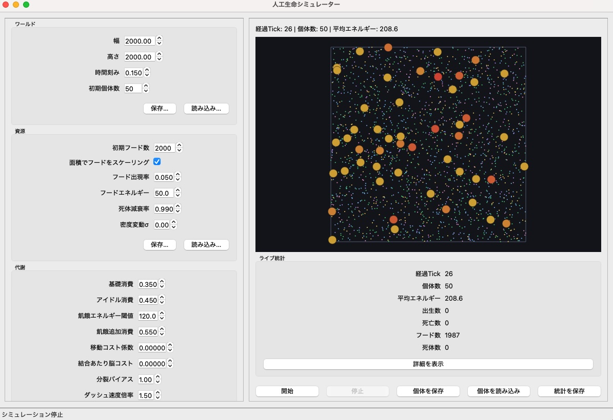
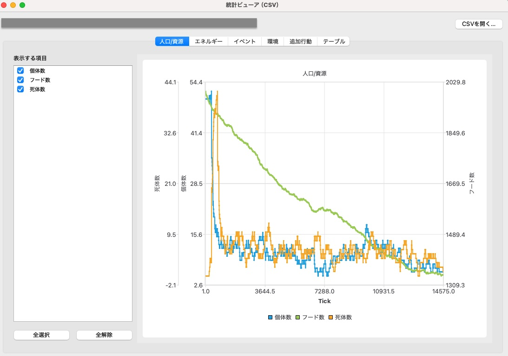

<<<<<<< HEAD
<<<<<<< HEAD
# Artificial Life Simulator GUI

人工生命シミュレーションを操作・観察するための PySide6 製 GUI アプリケーションです。  
NEAT 風の可変構造脳を持つ個体シミュレーション（`app/sim/neat_simulation.py`）をヘッドレスで動かしながら、パラメータ変更・可視化・データ保存／読み込みを GUI から行えます。  
`old/` ディレクトリには旧実装が残っていますが、今後は `app/sim/neat_simulation.py` を利用してください。



---

## 主な特徴
- **リアルタイム表示**: 個体・餌・死体の配置をトップダウンで描画するワールドビュー、統計情報（個体数・平均エネルギー・出生／死亡数・資源数）をリアルタイムで表示。
- **シミュレーション制御**: GUI から開始／停止・スナップショット取得が可能。NEAT 実装とダミー実装（スタブ）をコマンドラインで切り替え可能。
- **設定編集**: World / Resources / Metabolism / Brain の各セクションを GUI 上で編集。セクションごとに JSON として保存・読み込みでき、前回使用したファイルパスを記憶します。
- **環境ダイナミクス**: 資源密度の変動に加え、季節周期・危険ゾーン強度/割合を指定して、動的に適応圧を変えられます。
- **マルチタイプフード**: 栄養価と出現確率の異なる複数種類のフードを生成し、エージェントは種類のみを手がかりに高栄養／低栄養資源へ適応します。
- **エージェント保存／読み込み**: `last10_genomes.json` 相当の形式で任意の場所に保存・読み込みが可能。読み込んだファイルのパスも記憶し、次回起動時にサジェストします。既存ファイルへ上書き保存する際は同名ファイルを自動的にタイムスタンプ付きでバックアップし、過去データを残せます。
- **統計の保存と可視化**: 実行中の統計を CSV として保存し、別ウィンドウの「統計ビューア」で複数グラフとして可視化できます。
- **個体情報のホバー表示**: 個体にマウスを乗せると、ID/系譜/戦略ラベル/累積行動などがポップアップ表示されます。
- **状態永続化**: `.alsim_state.json` に最後に使用したファイルパスを保存し、次回起動時に自動復元。

---

## ディレクトリ構成
```
.
├── app/                     # GUI アプリケーション
│   ├── main.py              # エントリーポイント
│   ├── core/                # バックエンド・設定関連
│   ├── sim/                 # NEAT シミュレーション本体
│   ├── ui/                  # Qt ウィジェット
│   │   └── stats_viewer.py   # 統計CSVの可視化ウィンドウ
│   └── state_manager.py     # ファイルパス永続化
├── old/                     # 旧シミュレーション実装（移行期間用）
│   └── evo_sim_neat_diverse.py
├── last10_genomes.json      # 直近保存したエージェント情報（例）
├── *_config.json            # セクションごとの設定保存例
└── README.md
```

---

## セットアップ
### 1. 仮想環境の作成
```bash
python -m venv .venv
```

### 2. 仮想環境の有効化
```bash
# macOS / Linux
source .venv/bin/activate

# Windows (PowerShell)
.venv\Scripts\Activate.ps1
```

### 3. 依存パッケージのインストール
```bash
pip install -r requirements.txt
```
※ 旧ビューア（`old/evo_sim_neat_diverse.py`）を起動する場合のみ `pygame` が必要です。

---

## 起動方法

### 1. スタブ（ダミー）バックエンドで試す場合
```bash
python -m app.main --backend stub
```
スタブは疑似的に統計値・ワールドビューを生成するため、依存ライブラリが少なく環境確認に便利です。

### 2. NEAT シミュレーションを GUI で動かす場合
```bash
python -m app.main --backend neat
```
デフォルトでは `app.sim.neat_simulation` が読み込まれます。  
別の実装を試したい場合は下記のように `--sim-module` や `--sim-file` を指定してください。

```bash
# カスタムモジュール名を使う場合
python -m app.main --sim-module mypkg.custom_sim

# 単独の .py ファイルを指定する場合
python -m app.main --sim-file path/to/custom_sim.py
```

### 3. Gradio UI を使う場合（追加UI）
```bash
python -m app.gradio_app
```
Hugging Face Spaces ではリポジトリ直下の `app.py` がエントリーポイントになります。

#### 主なコマンドラインオプション
| オプション | 説明 | 既定値 |
| ---------- | ---- | ------ |
| `--backend {neat,stub}` | 使用するバックエンド種別 | `neat` |
| `--sim-module NAME` | インポートするモジュール名 | `evo_sim_neat_diverse` |
| `--sim-file PATH` | モジュール ファイルへの絶対／相対パス | なし |
| `--tick-substeps N` | 1 GUI チックあたりのシミュレーション進行サブステップ | 1 |
| `--sleep-interval SEC` | バックエンドの `step()` 呼び出し間隔秒 | 0.01 |

---

## GUI の使い方

### メイン画面
- ステータスバーに実行状態（Running/Stopped）を表示。
- 左ペインで設定編集、右ペインで世界表示・統計・操作ボタン／ログを配置。
- `Start` / `Stop` ボタンでシミュレーション制御。
- `Save Agents` / `Load Agents` でエージェント情報を保存／復元。保存時に同名ファイルが存在すると、自動的に `<name>_YYYYmmdd-HHMMSS.json` 形式のバックアップへ退避した上で新規ファイルを書き込みます。
- `統計を保存` で実行中の統計を CSV へ保存できます。
- メニュー `ファイル → 統計ビューア…` から統計CSVを読み込み、別ウィンドウでグラフ表示できます。

#### 統計ビューア


### ワールドビュー
- 黒背景に緑（餌）、茶色（死体）、色付き円（個体）を描画。
- 個体の色はエネルギー量で変化し、サイズは体格でスケーリング。
- 危険フィールドが有効な場合、危険度を半透明オーバーレイで表示します。
- 個体にマウスを乗せると個体情報（ID/戦略/親ID/各種カウンタ）がポップアップ表示されます。

### 設定エディタ
- `World` `Resources` `Metabolism` `Brain & Mutation` の 4 セクション。
- 各セクションに `Save…` / `Load…` ボタンを配置し、JSON ファイルとの入出力が可能。
- 例: `world_config.json`, `resources_config.json` など。`Resources` セクションでは密度変動パラメータ（σ）を指定でき、フードの出現密度フィールドをランダム生成できます。
- `Metabolism` では分裂バイアスを 1 つのスライダで調整でき、分裂の閾値・コスト・子エネルギーがまとめてスケーリングされます。さらに、NEAT 個体は「分裂しやすさ」を遺伝子情報として保持しており、世代を経てこの指標が進化します（詳細は「シミュレーション内部仕様」を参照）。
- `Brain & Mutation` の「追加行動（ダッシュ/防御/休息）」を有効にすると、行動出力が拡張されます（実験用）。

---

## 保存フォーマット

### 1. エージェント (`last10_genomes.json`)
`evo_sim_neat_diverse.py` の実装と同じ形式で保存されます（出生エネルギーの高い上位個体を 10 件保存）。

```json
[
  {
    "genome": {
      "nodes": [{"id": 0, "type": 0, "bias": 0.0}, ...],
      "conns": [{"innov": 1, "in_id": 0, "out_id": 100, "w": 0.42, "enabled": true}, ...],
      "in_ids": [0,1,2,...],
      "out_ids": [100,101,...]
    },
    "S": 1.03,
    "fission_trait": 0.92
  },
  ...
]
```

NEAT バックエンドで読み込む際は `_bootstrap_from_last10_diverse` が自動で呼び出され、クラスタリング後に個体を再配置します。

### 2. セクション設定 (`*_config.json`)
各セクションごとの値を含むシンプルな JSON オブジェクトです。例（World 設定）:
```json
{
  "width": 2000.0,
  "height": 2000.0,
  "time_step": 0.15,
  "initial_population": 50
}
```

---

## 永続化されるファイル

| ファイル | 役割 |
| -------- | ---- |
| `.alsim_state.json` | 最後に使用したエージェント／設定ファイルのパスを保存。 |
| `last10_genomes.json` | `Save Agents` ボタンの既定候補。 |
| `*_config.json` | セクション別の設定バックアップ例。 |
| `simulation_stats.csv` | `統計を保存` で出力する統計CSV（任意）。 |

`.alsim_state.json` はアプリ終了時もしくは保存操作時に随時更新され、次回起動時に自動的に読み込まれます。

---

## 開発メモ
- GUI は PySide6 を前提にしているため、macOS / Windows / Linux いずれでも Qt ランタイムが利用可能。
- バックエンドは `SimulationBackend` プロトコルに従って実装し、`step()` / `snapshot()` / `save_agents()` / `load_agents()` を備えれば GUI と連携できます。
- `StubSimulationBackend` は UI 検証用のサンプル実装であり、実際のシミュレーションロジックは `NeatSimulationBackend` を介して `evo_sim_neat_diverse.py` と連携します。

### シミュレーション内部仕様アップデート
- **全滅時の環境リセット**: 個体が 0 になった場合、過去のデータから再播種する前にフード分布を初期状態へ戻し、飢餓で即再滅しにくくしました。
- **分裂しやすさの遺伝**: 個体ごとに「分裂バイアス」（`fission_trait`）を持ち、エネルギー閾値・必要摂食量・親コスト・子エネルギーが個体単位でスケーリングされます。交叉／突然変異の対象でもあるため、世代交代で分裂頻度が進化します。
- **エージェント保存時のバックアップ**: GUI からの保存操作で既存ファイルがある場合は必ず時刻付きファイル名に退避し、データを失わないようになりました。

---

## トラブルシュート
- **ModuleNotFoundError: `evo_sim_neat_diverse`**  
  `--sim-file old/evo_sim_neat_diverse.py` を指定するか、モジュールを PYTHONPATH に追加してください。
- **pygame の初期化エラー**  
  NEAT バックエンドでは pygame をインポートします。GUI 実行中はヘッドレスで動作するように設定されていますが、pygame がインストールされていることを確認してください。
- **設定ファイルに無効な値を入れた**  
  `Load…` 操作で不正な JSON を読み込んだ場合、エラーダイアログが表示されます。既定値に戻したい場合はアプリを再起動するか、適切な JSON を読み込み直してください。

---

## ライセンス
特に明記していない限り、本リポジトリ内のコードは MIT ライセンスを前提としています（`app/*.py` の各ファイル先頭参照）。シミュレーションロジックの一部は元実装に従います。

---

## 参考ドキュメント
- [ロードマップ](docs/roadmap.md)
- [NEAT シミュレーション仕様](docs/neat_simulation.md)
=======
---
title: Artificial Life Simulator GUI
emoji: 📉
colorFrom: red
colorTo: purple
sdk: gradio
sdk_version: 6.3.0
app_file: app.py
pinned: false
license: mit
---

Check out the configuration reference at https://huggingface.co/docs/hub/spaces-config-reference
>>>>>>> b1e1fa1 (initial commit)
=======
# Artificial Life Simulator — NEAT + Fission + Diverse Reseed (Spec)

- **ファイル**: `evo_sim_neat_diverse.py`
- **最終更新**: 2025-10-22
- **要約**: 2000×2000 のトーラス世界で、NEAT 風の可変構造脳を持つ個体が移動・捕食・交配・分裂する人工生命シミュレーター。絶滅時は最後の 10 個体をクラスタリングし、各クラスタから均等サンプリング＋微小変異で `N_INIT` 体を再播種して継続観察する。

---

## 1. 世界 (World)

- サイズ: `W=2000`, `H=2000`（トーラス境界）
- 時間刻み: `DT=0.15`
- 空間分割: グリッドセル `CELL=40` による近傍検索（`GRID_W`, `GRID_H`）
- 初期個体数: `N_INIT=50`
- 初期フード一括投入:
  - `INITIAL_FOOD_PIECES=2000` を面積スケールしてばら撒き
  - `INITIAL_FOOD_SCALE=True` なら `(W×H)/(2000×2000)` を乗じて自動調整
- ランタイムのフード出現: 毎 tick `FOOD_RATE=0.05` の確率で 1 個出現
- フード量: `FOOD_EN=50`（1 ピースのエネルギー）
- 死体: 殺害／自然死で `Body` を生成。エネルギー `BODY_INIT_EN=80`、毎 tick `DECAY_BODY=0.995` で減衰

---

## 2. 個体 (Agent)

- 状態: 位置 `(x, y)`, 速度 `(vx, vy)`, 体格 `S∈[0.8, 1.2]`, エネルギー `E`, 脳 (Genome)
- 行動出力（連続／離散混合）:
  - `thrust`（推進, `tanh`）
  - `turn`（旋回, `tanh×0.3`）
  - `attack`（攻撃トグル）
  - `mate`（交配トグル）
  - `eat_strength`（摂食強度, `[0..1]`）
- 速度上限: `vmax = SPEED_MAX_BASE * (1.2 - 0.2 * S)`（体格が大きいほど遅い）

### 2.1 センシング

- 視覚レイ: `N_RAYS=5` 本、各レイで近傍（他個体）の距離、相対サイズ（S 比）、相対速度投影を取得（上限距離 `R_SENSE=180`）
- 自己状態入力: `[E 正規化, S 正規化, 速度比, ダミー]`
- 入力次元: `IN_FEATURES = N_RAYS * 3 + 4`

---

## 3. 脳 (NEAT 風の可変構造)

- 表現: 有向非巡回グラフ (DAG)
- ノード: `NodeGene(id, type, bias)`（`type ∈ {INPUT, HIDDEN, OUTPUT}`）
- 結合: `ConnGene(innov, in_id, out_id, w, enabled)`
- イノベーション番号は `(in_id, out_id)` ペアで一意（`InnovationDB`）
- 初期化: 入力→出力の疎な結合をランダム生成
- 推論: トポロジ順序をキャッシュ（Kahn 法）。中間は `tanh`、出力は線形（行動側で `tanh` などに変換）
- 変異:
  - 構造: `add_connection`, `add_node`, `del_connection`（確率は `P_ADD_CONN=0.20`, `P_ADD_NODE=0.08`, `P_DEL_CONN=0.02`）
  - 重み／バイアス: ガウス摂動（`WEIGHT_SIGMA=0.08`, `WEIGHT_DRIFT_P=0.8`）
  - 微小変異（再播種／分裂用）: `micro_mutate(weight_sigma=0.03, p_add_conn=0.04, p_add_node=0.015, p_del_conn=0.008)`
- 交叉: イノベーション番号整列で親から混合

**脳コスト**: `BRAIN_COST_PER_CONN=0.0006` ×（有効結合数）を毎 tick のエネルギー消費に加算

---

## 4. 代謝・エネルギー

- 移動コスト: `MOVE_COST_K * speed^2`（`MOVE_COST_K=0.001`）
- 脳コスト: 上記の結合数比例
- 基礎代謝: `BASE_COST=0.35`（停止していても減る）
- 飢餓コスト: `E < STARVATION_E (=120)` のとき `STARVATION_COST=0.55`
- アイドル・ペナルティ:
  - `spd < IDLE_SPEED_FRAC * vmax`（`IDLE_SPEED_FRAC=0.10`）かつ
  - `|thrust| < 0.2` 且つ `|turn| < 0.05` のとき `IDLE_COST=0.45` 追加

目的: 止まっていると強く不利、空腹時ほど寿命短縮。

---

## 5. 相互作用

- 摂食:
  - フード: 距離 `< R_HIT=12` で `take = min(f.e, FOOD_EN) * (0.3 + 0.7 * eat_strength)`
  - 死体: 同様に `take = min(body.e, 10.0 * (0.3 + 0.7 * eat_strength))`
  - 摂食量は分裂判定のカウンタ `eaten_units` に加算
- 交配（有性）:
  - 互いに `mate` が真、距離 `< R_HIT`、両者 `E > E_BIRTH_THRESHOLD=220`、相性 `is_compatible(a, b)` を満たす
  - 子の Genome は交叉＋構造／重み変異、子 `E=CHILD_EN=120`、親は `PARENT_COST=80` 消費
- 攻撃（捕食）:
  - `attack` 真かつ `8.0 * a.S > 5.0 * b.S` で殺害成功、攻撃者 `E += 60`、死体を生成
- 分裂（無性）:
  - `E > FISSION_ENERGY_TH=280` かつ `eaten_units >= FISSION_FOOD_UNITS_TH=5`
  - 親のクローンに微小変異を適用して子生成（子 `E=100`、親 `-70`、カウンタリセット）

---

## 6. 絶滅セーフティ & 多様性再播種

- 保存: 実行中に約 10 秒間隔で上位 10 個体（`E` の高い順）を `last10_genomes.json` に保存
- 絶滅検知: 全個体消滅時
- 再播種:
  1. `last10` を読み込み、各 Genome を特徴ベクトル化（64 次元ハッシュ + 6 統計 = 70 次元, L2 正規化）
  2. `K-means`（`2〜min(5, n)` クラスタ）
     - `K-means++` 初期化を数値安定化
     - 同一点群／少数データにも対応
     - 空クラスタはランダム再初期化
  3. 各クラスタから均等ラウンドロビンでサンプリング → サンプリング個体のゲノムは微小変異して `N_INIT` 体を生成
- ロード操作: `L` キーで手動リシード（クラスタ均等）

---

## 7. 可視化 & 操作

- 表示: `pygame`
- 個体は体格 `S` とエネルギーで色／サイズが変化、向きに短いベクトルを描画
- フードは緑、死体は茶色
- HUD: 時刻 `t`、個体数 `n`、平均エネルギー `meanE`、出生／死亡カウンタ、FPS、操作ガイド
- キー操作:
  - `SPACE`: 一時停止／再開
  - `F`: 高速モード（`1 tick → 6 substeps`）
  - `S`: スクリーンショット保存（`screens/`）
  - `R`: ランダム初期化
  - `L`: `last10` から多様性リシード
  - `Q` / `ESC`: 終了

---

## 8. 主要パラメータ（チューニング指針）

| 目的 | パラメータ | 推奨調整 |
| --- | --- | --- |
| 初期の餌不足解消 | `INITIAL_FOOD_PIECES`, `INITIAL_FOOD_SCALE` | `2000→3000` など増量 |
| 継続的な餌密度 | `FOOD_RATE` | `0.05→0.08` で湧き増 |
| 1 個あたり回復量 | `FOOD_EN` | `50→80` で強化 |
| 停止を不利に | `BASE_COST`, `IDLE_COST` | `+0.1` 刻みで上げる |
| 空腹時の寿命短縮 | `STARVATION_E`, `STARVATION_COST` | `E` 域を広げる／消費増やす |
| 脳の肥大抑制 | `BRAIN_COST_PER_CONN` | `0.0006→0.0010` |
| 高速ダラダラ抑制 | `MOVE_COST_K` | 速度² 比例、`0.001→0.006` |

---

## 9. 保存フォーマット

`last10_genomes.json`:

```json
[
  {
    "genome": {
      "nodes": [{"id": int, "type": 0 | 1 | 2, "bias": float}, ...],
      "conns": [{"innov": int, "in_id": int, "out_id": int, "w": float, "enabled": bool}, ...],
      "in_ids": [int, ...],
      "out_ids": [int, ...]
    },
    "S": float
  },
  ...
]
```

---

## 10. 再現性・性能

- 乱数: `numpy.default_rng(1)` と `random.Random(1)` を使用（完全固定ではないが近い）
- 近傍探索: グリッドで疑似 `O(1)` 近傍
- 推論: 変異時のみトポロジ再構成、通常はキャッシュ

---

## 11. 拡張案

- 入力拡張: フード／死体専用レイ、群集密度、履歴ベクトル
- 表示強化: クラスタごとに色分け、行動ヒートマップ
- 制約: `STALL_KILL_TICKS`（長時間アイドル即死）
- 遺伝子拡張: 出力増（例えば探索／回避モード切替）

---

## 12. トラブルシュート

- `K-means` 初期化エラー（確率が 1 にならない）
  - 実装側でゼロ和／NaN を一様分布にフォールバック済み
- 初期で餓死が多い
  - `INITIAL_FOOD_PIECES` 増、`FOOD_RATE` 増、`FOOD_EN` 増
- 止まりがち
  - `BASE_COST` / `IDLE_COST` / `STARVATION_COST` の順に上げる
- 頻繁に絶滅
  - フード増、代謝弱め、分裂閾値引き下げ

---

## 13. 実行

```bash
python -m venv .venv
source .venv/bin/activate   # Windows: .venv\Scripts\Activate
pip install pygame
python evo_sim_neat_diverse.py
```
>>>>>>> 0cedf28 (Add evolutionary simulation with agent-based model and visualization)
